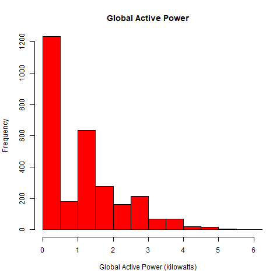
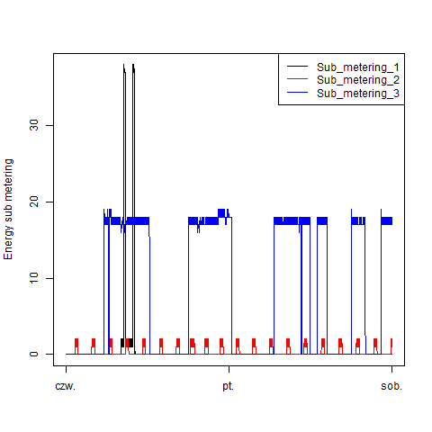
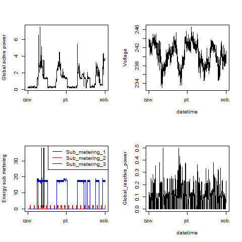

## Introduction
This Exploratory Data Analysis assignment uses data from
the <a href="http://archive.ics.uci.edu/ml/">UC Irvine Machine
Learning Repository</a>, a popular repository for machine learning
datasets. The "Individual household
electric power consumption Data Set" was used in this project.

## Preparing Data
* <b>Dataset</b>: <a href="https://d396qusza40orc.cloudfront.net/exdata%2Fdata%2Fhousehold_power_consumption.zip">Electric power consumption</a> [20Mb]
* <b>Description</b>: Measurements of electric power consumption in
one household with a one-minute sampling rate over a period of almost
4 years. Different electrical quantities and some sub-metering values
are available.

The following descriptions of the 9 variables in the dataset are taken
from
the <a href="https://archive.ics.uci.edu/ml/datasets/Individual+household+electric+power+consumption">UCI
web site</a>:
<ol>
<li><b>Date</b>: Date in format dd/mm/yyyy </li>
<li><b>Time</b>: time in format hh:mm:ss </li>
<li><b>Global_active_power</b>: household global minute-averaged active power (in kilowatt) </li>
<li><b>Global_reactive_power</b>: household global minute-averaged reactive power (in kilowatt) </li>
<li><b>Voltage</b>: minute-averaged voltage (in volt) </li>
<li><b>Global_intensity</b>: household global minute-averaged current intensity (in ampere) </li>
<li><b>Sub_metering_1</b>: energy sub-metering No. 1 (in watt-hour of active energy). It corresponds to the kitchen, containing mainly a dishwasher, an oven and a microwave (hot plates are not electric but gas powered). </li>
<li><b>Sub_metering_2</b>: energy sub-metering No. 2 (in watt-hour of active energy). It corresponds to the laundry room, containing a washing-machine, a tumble-drier, a refrigerator and a light. </li>
<li><b>Sub_metering_3</b>: energy sub-metering No. 3 (in watt-hour of active energy). It corresponds to an electric water-heater and an air-conditioner.</li>
</ol>

## Making Plots
The plots should look like the plots from this GitHub repository:
[https://github.com/rdpeng/ExData_Plotting1](https://github.com/rdpeng/ExData_Plotting1)

## Preparing Data
```
#read it into a table and create a new table with the date and time
tbl <- read.table("household_power_consumption.txt", dec = ".", stringsAsFactors = FALSE,
                  colClasses = c("character", "character", "numeric", "numeric", "numeric", "numeric", "numeric", "numeric", "numeric"), 
                  header = TRUE, sep = ";", na.strings = "?")

#subset data
df <- filter(tbl, Date %in% c("1/2/2007", "2/2/2007"))

# new column date_time (x axis)
df$Date <- as.Date(df$Date, "%d/%m/%Y")

df <- 
  mutate(df, date_time = as.POSIXct(paste(df$Date, df$Time, sep=" "), 
  template = "%d/%m/%Y %H:%M:%S", tz = "Sys.timezone"()))
```
### Plot 1
```
png("plot1.png", width=480, height=480)

hist(df$Global_active_power, col = "red", main = "Global Active Power", 
     xlab = "Global Active Power (kilowatts)", ylim = c(0,1200), 
     xlim = c(0,6), breaks = 12)
dev.off()
```
 

### Plot 2
```
png("plot2.png", width=480, height=480)

plot(x=df$date_time, y = df$Global_active_power, type="l", xlab="", ylab="Global Active Power (kilowatts)")
dev.off()
```
 

### Plot 3
```
png("plot3.png", width=480, height=480)
with(df, 
     { plot(x=date_time, y = Sub_metering_1, type="l", col = "black", xlab="", ylab="Energy sub metering")
       lines(x=date_time, y = Sub_metering_2, type="l", col = "red")
       lines(x=date_time, y = Sub_metering_3, type="l", col = "blue")
       legend("topright", lty = "solid", col = c("black", "red", "blue"), 
        legend = c("Sub_metering_1","Sub_metering_2", "Sub_metering_3"))
     })
dev.off()
```
 

### Plot 4
```
png("plot4.png", width=480, height=480)
par(mfrow = c(2,2))

plot(x = df$date_time, y = df$Global_active_power, type="l", col = "black", xlab="", ylab="Global active power")

plot(x=df$date_time, y = df$Voltage, type="l", col = "black", ylab="Voltage", xlab = "datetime")

with(df, 
     { plot(x=date_time, y = Sub_metering_1, type="l", col = "black", xlab="", ylab="Energy sub metering")
       lines(x=date_time, y = Sub_metering_2, type="l", col = "red")
       lines(x=date_time, y = Sub_metering_3, type="l", col = "blue")
       legend("topright", lty = "solid", col = c("black", "red", "blue"), 
              legend = c("Sub_metering_1","Sub_metering_2", "Sub_metering_3"))
     })

plot(x=df$date_time, y = df$Global_reactive_power, type="l", col = "black", ylab="Global_reactive_power", xlab = "datetime")
dev.off()
```
 

